<b>English</b> &nbsp;·&nbsp; <a href="./README.zh.md">中文</a>

  
  
  
  

  
  &nbsp;
  
  &nbsp;
  

**Not another habit tracker. Your lifelong Growth Operating System.**

Personal OS is a **local-first desktop app with a built-in compounding loop.** It turns your eulogy into a North Star, calibrates your judgment on every decision (with a real Brier score), reads envy / anger / flow as clues to your mission, depreciates skills that aren't backed by evidence, and runs an AI that plays devil's advocate every week. Everything lives in **one local SQLite file**, you **bring your own model key**, and nothing ever touches the cloud. **Buy once, yours for life** — no subscription, no cloud bill.

---

## ✦ Six mechanisms you won't find elsewhere

| Mechanism | What it does |
|---|---|
| **Eulogy North Star** | No KPIs—reverse-engineer direction from the end of your life. AI helps you clarify how you want to be remembered, the anchor for the whole system. |
| **Decision Calibration** | Stake a confidence level on every decision; reconcile when due. A Brier score shows the real curve of your judgment—and sharpens it week by week. |
| **Mission-Signal Radar** | Envy, anger and flow aren't just emotions—they're clues to your mission. AI clusters scattered signals into testable mission hypotheses. |
| **Capability Ledger · Depreciation** | Skills "depreciate." Levels must be backed by evidence or they cap at L1—no self-flattery, only real output. |
| **Adversarial Weekly Review** | AI plays devil's advocate, forcing you to face what you dodged—converging into ≤3 actions and this week's North Star. |
| **Anti-Goals & Low-Point Protocol** | Negative space as an opportunity filter; write your low-point plan while you're strong. Guardrails, not pep talk. |

> **The loop that turns itself: Capture → Insight → Act → Verify.** Each loop you close, the system's model of you gets sharper—growth that compounds.

---

## 🔒 Your data, only yours

| | |
|---|---|
| **Local storage, never in the cloud** | All your data is one local SQLite file, only on your machine. |
| **Bring your own model key** | Add your own API key—privacy and cost stay yours; the key is written only locally. |
| **One-click export · full migration** | Export JSON, or copy the whole database file to a new machine—like moving an Obsidian vault. |
| **No lock-in** | Open format, take it anytime. Stop paying and the data is still yours. |

---

## 🧠 Bring your own model

Pick a provider in Settings and paste your own key — it stays local:

`OpenAI GPT` · `Anthropic Claude` · `DeepSeek` · `Kimi (Moonshot)` · `GLM (Zhipu)`

---

## 🚀 Quick start

1. **Download & install** — Windows / macOS above.
2. **Create your account** — open the app; data starts blank.
3. **Pick a model, add your key** — Settings → AI.
4. **Write your first eulogy** — ~15 minutes to light up your North Star.

> 🍎 On macOS, if the first launch warns "unidentified developer," **right-click → Open** (the build is currently unsigned).

---

## 💎 Pricing

**Free to start, locally.** A one-time buyout is planned (¥299, coming soon) — no subscription, no cloud bill.

---

## ❓ FAQ

<b>Where is my data stored? Is it uploaded?</b>

Everything lives in a local SQLite file on your machine, never in the cloud. AI calls go directly from your machine to the model provider you configured — we never touch or store them.

<b>Why do I bring my own API key?</b>

So privacy, cost and model choice all stay yours. Use a low-cost model like DeepSeek, or switch to GPT / Claude anytime.

<b>I switched computers — what about my data?</b>

Export JSON in one click, or copy that one local database file to the new machine — as simple as moving an Obsidian vault.

---

## 🛠 Tech & privacy

- **Local-first desktop app** (Electron) with a pure local SQLite data layer — no cloud, no multi-tenant, no account server.
- **Bring your own model** — a pluggable LLM layer compatible with the OpenAI and Anthropic APIs.
- **Data sovereignty** — open format, one-click export, take it anytime.

 

**Live your life as a system that compounds.**

[⬇ Windows](https://github.com/AQ-zero/personal-os-harness/releases/latest/download/Personal-OS-Setup.exe) &nbsp;·&nbsp; [⬇ macOS](https://github.com/AQ-zero/personal-os-harness/releases/latest/download/Personal-OS.dmg) &nbsp;·&nbsp; [🌐 Website](https://aq-zero.github.io/personal-os-harness)

© 2026 Personal OS · Built by a one-person company

